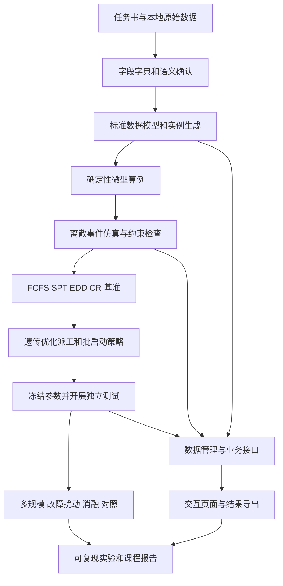

# 半导体制造系统的智能调度：完整实现思路与实施方案

编制日期：2026-09-20；修订：总周期 14 周，增加布局边界与二维虚拟车间方案。依据：本地 `00-指导文件/A3-半导体制造系统的智能调度.md` 及 `datasets` 内全部 32 个文件。本文件是待实施方案；本次完成了任务分析和数据结构核验，尚未实现仿真、优化算法或系统，未产生算法性能结果。

## 1. 总体决策与任务边界

建议建设一个“基于 SMT2020、支持批处理与动态扰动的晶圆厂调度实验及信息系统”。主线采用 **Python 离散事件仿真 + FCFS/SPT/EDD/CR 基准 + 约束感知的遗传算法优化调度策略 + 分层业务系统**。小规模 CP-SAT 用于校核，强化学习作为主线完成后的可选扩展。

任务书列举 CGA、强化学习、MIP/约束编程作为算法示例，并未要求同时完成所有算法。课程设计的重点应是：数据解释正确、物理规则可信、优化方法有依据、实验对照公平、系统能运行、结果能复现。

需要区分三个对象：wafer 是单片晶圆，lot 是生产流转批量，batch 是设备一次同时加工的多个兼容 lot。调度同时决定“哪些 lot 先加工”“在哪台设备加工”“如何组 batch”“何时启动 batch”。

| 任务书要求         | 具体实现                                       | 可验收证据                               |
| ------------------ | ---------------------------------------------- | ---------------------------------------- |
| 数据集理解与预处理 | 解析原始表、字段字典、约束表、实例生成器       | 数据审计、来源映射、规模统计、工艺路径图 |
| 建立排产模型       | 带重入、并行机、批处理和动态事件的作业车间模型 | 变量与约束说明、可行性检查器             |
| 基准方法           | FCFS、SPT、EDD，补充 CR 和原始复合规则参考     | 同环境下的基准输出与运行日志             |
| 智能算法           | 遗传算法学习派工评分参数及批启动参数           | 参数文件、搜索轨迹、独立测试结果         |
| 仿真与对比         | 离散事件仿真、多规模、多扰动、多随机种子       | 指标表、置信区间、消融实验、事件轨迹     |
| 完整信息系统       | 数据、存储、引擎、业务、交互五层               | 数据导入到结果导出的完整操作流程         |
| 文档与源代码       | 七部分报告、代码、依赖、README、算法产物       | 干净环境复现记录                         |

## 2. 本地数据核验结果

实际路径使用普通连字符 `00-指导文件/A3-半导体制造系统的智能调度.md`，与请求中显示的特殊连字符略有不同。数据均是制表符分隔的文本表，设备文件为 `tool.txt.1l`，导入时不能只匹配 `*.txt`。

| 项目                           |        SMT2020_HVLM | SMT2020_LVHM |
| ------------------------------ | ------------------: | -----------: |
| 文件数                         |                  12 |           20 |
| 产品数                         | 2，part_3 与 part_4 |           10 |
| 路线长度                       |            583、343 |     242～583 |
| 设备表记录数                   |                 106 |          106 |
| 排除 Delay_32 后的设备组数     |                 105 |          105 |
| STNQTY 合计                    |                1443 |         1313 |
| 排除 Delay_32 后的 STNQTY 合计 |                1043 |          913 |
| 初始 WIP 记录数                |                2255 |         2156 |
| 重复投放规则数                 |                   5 |           21 |
| 路线中的 per_batch 工序记录数  |                  28 |          135 |
| 非空 STEP_CQT 记录数           |                  66 |          264 |
| 非空 SVESTN 记录数             |                  18 |           73 |

两套设备表均含 `Delay_32`，其 `STNQTY=400`，属于延迟资源，应单独建模；不能据此宣传“1443 台实际加工设备”。其余设备数量按 STNQTY 生成模型中的设备实例，并保留来源信息。现有工序设备组引用、WIP 产品与当前工序引用检查未发现缺失；这些检查不代表所有字段语义已经验证。

各路线工序数：r_1=521、r_2=529、r_3=583、r_4=343、r_5=242、r_6=293、r_7=353、r_8=375、r_9=384、r_10=390。任务书“每条路线超过 500 道”的概括不适用于全部本地路线，报告应使用实测值。

当前目录只提供 HVLM、LVHM 两个基础模型；没有独立工程批模型目录。工程批扩展不作为本地数据已有能力。

### 2.1 文件与标准对象的对应关系

| 原始文件     | 关键字段                                       | 标准对象与用途                     |
| ------------ | ---------------------------------------------- | ---------------------------------- |
| part.txt     | PART、ROUTEFILE、ROUTE                         | 产品与路线关联                     |
| route_*.txt  | ROUTE、STEP、STNFAM、PTPER、PTIME              | 工序顺序、设备资格、加工模型       |
| tool.txt.1l  | STNFAM、STNQTY、STNCAP、BATCHPER、STNGRP       | 设备组、设备实例、容量和功能区     |
| order.txt    | START、RDIST、REPEAT、RUNITS、RPT#、LOTSPERRPT | 动态投放生成器，而非一次性订单列表 |
| WIP.txt      | LOT、PART、CURSTEP、DUE、PRIOR                 | 初始在制品快照                     |
| setup.txt    | CURSETUP、NEWSETUP、STIME                      | 与当前状态相关的换型时间           |
| setupgrp.txt | SETUPGRP、SETUP、MINRUN                        | 换型组及最小运行约束               |
| downcal.txt  | MTTFDIST、MTTF、MTTRDIST、MTTR                 | 故障间隔与维修时间                 |
| pmcal.txt    | PMCALTYPE、MTBPM、MTTR、MTTR2                  | 预防性维护规则                     |
| attach.txt   | CALTYPE、RESTYPE、RESNAME、FOA                 | 日历绑定范围和首次事件             |
| fromto.txt   | FROMLOC、TOLOC、DDIST、DTIME、DTIME2           | 搬运时间模型                       |

### 2.2 必须先冻结的数据语义

1. **时间统一。** 内部统一分钟，保留原始 min/hr/day 字段；以 2018-01-01 为本地数据仿真零点，不替换为当前日期。源日期按月/日/年解析。
2. **加工时间单位。** per_lot 表示 lot 层时间，per_batch 表示共享批加工时间，per_piece 表示晶圆层时间；只有在没有级联、重叠等机制时，才能用晶圆数直接乘 per_piece 时间。`PartInterval`、`BatchInterval`、`STNCAP` 必须联合解释。
3. **批量边界。** 扩散设备存在 `BATCHPER=piece`，`BATCHMN=125/BATCHMX=150` 对应晶圆数。本地 lot 数量均为 25，因此完整 lot 不拆分时该工序可组 5～6 个 lot。不能误写成一次加工 125～150 个 lot。
4. **批兼容性。** 本地有 `BATCHCRITF=crit_sameroutestep`；首版按相同路线、相同步骤组批。即使不同产品使用同一设备、时间相同，也不能自行混批。
5. **CQT 是显式跨工序边。** 例如 r_3 的 STEP=243 指向 STEP_CQT=250，不能将 CQT 简化成“下一道工序等待时间”。建立独立的起点、终点与限时表。起算、终止时刻是开始还是完成，需从格式说明确认；本文模型暂采用“起点完成到终点开始”，明确作为待核验契约。
6. **绑定是特定步骤间的关系。** `SVESTN/FORSTEP` 用于构建设备绑定边；不能假定一个 lot 所有光刻步骤都绑定同一设备。WIP 已越过绑定起点而未提供历史设备时，记录缺失，并采用公开、固定的初始化假设。
7. **重复订单与交期。** 延迟生成仿真时域内的 lot，避免把 RPT#=200000 直接展开。先确认重复 lot 的交期语义；可用“保留模板 DUE-START 相对交期”作为明确标注的实现假设，不能让后来投放的 lot 全部继承首批的绝对交期。
8. **初始 WIP 不是完整历史。** 本地所有 WIP START 相同，不能把其剩余完工时间冒充真实全流程 cycle time。初始 WIP 与新投放 lot 分开统计。
9. **优先级不能只看 HOTLOT。** 名为 HotLot 的订单也可能 `HOTLOT=no`；原始规则还使用 `PRIOR` 和 `rank_HP`。确认数值方向后建立 Regular/Hot/SuperHot 映射，保留原字段。
10. **分布参数不可猜测。** `uniform` 的 PTIME2/MTTR2/DTIME2 是否表示半宽，需要格式说明确认。例如 PTIME2 常小于 PTIME，不能直接当作 uniform 的上界。未确认前允许确定性调试，不应声称实现了完整随机模型。
11. **空值按字段处理。** setupgrp 的后续空组名可能是续行；setup 的空 CURSETUP 可能是通配；attach 存在空 FOAUNITS。不能全表填零或统一前向填充。
12. **抽样、返工和维护。** 明确 StepPercent 是执行还是跳过百分比，REWORK 的百分比含义、RWKSTEP 的返工落点、维护绑定到单机还是整组，以及加工中故障如何暂停/恢复。不能仅凭字段名确定原模型行为。

以上形成 `data_dictionary.md` 和 `assumptions.yaml`：逐字段记录原值、来源文件行号、解释、单位、证据、确认状态及实现模块。取得原始 AutoSched/generic 格式文档后补全；本次原作者下载入口未能通过浏览工具打开，原格式契约仍有待核验部分。

## 3. 实施路线与版本边界



| 版本                 | 完成内容                                              | 边界                                   |
| -------------------- | ----------------------------------------------------- | -------------------------------------- |
| V0：数据与确定性验证 | 解析、单位、微型路线、顺序、资源互斥                  | 用于调试，无全厂结论                   |
| V1：最小闭环         | 动态投放、WIP、单 lot/批加工、setup、基准、日志       | 未实现的机制须展示并记录               |
| V2：正式实验模型     | CQT、设备绑定、级联、抽样/返工、PM/故障及真实数据接入 | 语义核验和规则测试通过后才进入最终对比 |
| V3：算法与完整系统   | 优化策略、实验管理、图表、导出、文档                  | 形成课程验收版本                       |

若时间不足，优先减少算法种类和界面装饰。确需简化复杂工艺机制时，应降低模型保真声明、列明缺失并做影响分析，不能把简化环境的好结果称为完整 SMT2020 复现。

## 4. 数据建模与测试实例

### 4.1 标准实体

- `Product`：产品、路线；`Operation`：路线、步骤、加工与批处理参数。
- `ToolGroup`：设备资格与组规则；`Machine`：组内设备编号、状态、setup、日历、容量。
- `Lot`：数量、投放/交期、优先级、当前位置、绑定设备、返工次数和 CQT 状态。
- `Batch`：成员 lot、共同工序、晶圆总数、所选机台、准备/启动/完成时间。
- `ReleasePlan`、`MaintenanceRule`、`SetupTransition`、`CQTConstraint`、`DedicationEdge`。
- `Scenario`、`PolicyConfig`、`ExperimentRun`、`EventLog`、`MetricResult`。

工序用 `(route_id, step_id)` 唯一标识；执行事件再加入 lot_id 与 visit_index，以区分返工。lot 的固定路线不同于设备访问图：路线按工序顺序展开，设备组可被反复访问，返工边另外保存。

每条标准记录保留 `source_file`、`source_row`；原始文件只读，清洗结果和假设配置独立保存，生成数据版本/hash。设备实例 ID 由组 ID 与序号生成，不宣称这些是工厂实物序列号。

### 4.2 三类实例

| 层级         | 建议初始规模                                    | 用途                     |
| ------------ | ----------------------------------------------- | ------------------------ |
| 微型确定性   | 2～3 组、2～6 台、5～12 个 lot、每 lot 3～8 步  | 手算、规则单测、精确求解 |
| 中型派生实例 | 10～20 组、30～100 个 lot、20～60 步            | 迭代算法与消融           |
| 完整数据实例 | HVLM 与 LVHM 全路线、全设备、初始 WIP、动态投放 | 最终效果与扩展性         |

这些规模是建议配置，不是已生成数据。批工序微型算例须有足够兼容 lot，或明确生成缩小批容量的合成算例；不能只有 2 个 lot 却要求最少 5 个 lot，随后把无法启动视为算法错误。

真实数据子实例要保持约束闭合：保留工艺前驱、所需设备、批容量、setup、CQT 两端及绑定关系。若裁断路线，记录边界输入条件，指标称“子流程完成时间”；不能与全流程 cycle time 直接比较。设备减少时同步设计负荷，区分规模变化和拥堵变化。

## 5. 排产数学模型

研究对象为“固定产品工艺路线、设备组内并行设备、重入访问、批加工及动态随机事件”的调度问题。小规模确定性模型表达可行性，动态系统在事件发生后做在线决策。

设 lot 为 j，工序访问为 o，机台为 m，批次为 b；释放时间 r_j、交期 d_j、优先级权重 w_j、数量 q_j。主要决策：开始时间 S_jo、完成时间 C_jo、设备分配 x_jom、批成员 y_job、批启动 S_b、批设备 m_b。动态派工策略为 `π(state) -> dispatch action`。

关键约束：

1. 投放与前驱：首工序 S_j1 ≥ r_j；后工序 S_j,o+1 ≥ C_jo + transport_jo（跳步/返工时使用实际前驱）。
2. 设备资格：只能选工序允许的设备组及满足绑定条件的机台。
3. 设备容量：普通单容量设备的占用区间不可重叠；具有级联/多容量的设备必须单独建模，不能套用全程互斥。
4. 批容量：B_min ≤ Σ(j∈b) q_j ≤ B_max；批成员兼容、全部到齐，同批共享启动与批加工占用。
5. 换型：必要的 setup 占用设备，时间由状态转移和工序信息决定，避免重复相加；最小运行约束根据确认后的 MINRUN 契约处理。
6. CQT：暂定 S_j,target − C_j,source ≤ Q_j,source,target；跨步时间窗计入中间加工、等待与搬运。最终端点定义以核验后的字典为准。
7. 可用性：维护/故障期间不允许非法启动；加工中故障按公开规则暂停继续或重加工，修正完成事件。
8. 设备绑定：绑定步骤访问指定设备；初始化时缺失历史绑定必须有显式假设。

工艺顺序、设备资格和物理容量始终是硬约束。CQT 在小规模求解中可设为硬约束；随机仿真中允许记录实际发生的超时，并按统一业务规则继续、隔离或返工。发生超时不能通过删除该 lot 隐藏，也不能声称策略保证所有 CQT 都可行。

建议场景化定义目标：HVLM 主看吞吐量与周期，LVHM 主看加权延期和准时交付率；两者同时报告 CQT。不要把不同量纲直接相加。

一个待调优的无量纲适应度为：

`J(θ) = α·平均加权延期/T_ref + β·平均周期/CT_ref + γ·CQT违规率 + δ·剩余工作量/W_ref − η·吞吐量/TH_ref`。

参考尺度从训练集固定基准获取，并设置正数下限，测试阶段不重估。权重由研究重点确定并做敏感性分析。硬约束非法动作直接拒绝或判失败，不能用小罚项允许违反物理规则。未完成 lot 的剩余工作量/逾期暴露必须计入，避免只做短任务来美化平均周期。

## 6. 离散事件仿真环境

建议以 Python + SimPy 承载时间推进，业务规则自行实现；SimPy 提供事件和共享资源基础，并不自动提供半导体工艺语义。依据：[SimPy 官方文档](https://simpy.readthedocs.io/en/latest/)。也可在性能分析后使用自定义事件堆，第一版只维护一种内核。

### 6.1 事件与状态

事件至少包括：lot 投放、搬运到达、setup 结束、加工/批加工结束、抽样跳步、返工、维护开始/结束、故障/修复、CQT 到期、批等待唤醒。机台状态包括空闲、setup、加工、故障、维护；lot 状态包括未投放、运输、排队、加工、完成、异常。

同一时间戳的事件先统一更新相关状态，再派工；明确同时故障和完工的优先级，防止读取部分更新的队列。多台设备依次决策时立即预留 lot，避免同一 lot 被重复选中。故障使旧完成事件失效，需用事件版本或取消机制防止重复完工。

### 6.2 一次调度的执行过程

1. 收集目标机台当前可见的 lot，过滤前驱、运输、资格、绑定等不满足条件的项。
2. 普通机台形成单 lot 候选；批机台按兼容关系形成合法批候选。
3. 策略对合法候选评分，选择立即加工或等待一个明确事件。
4. 统一检查器验证动作，记录被拒原因；预留 lot 和设备。
5. 安排 setup、装载、加工及卸载事件；更新时间窗和绑定信息。
6. 加工结束推进实际路线，并触发下一次决策。

统一接口建议：`policy.select(state_view, feasible_actions) -> action`。StateView 只包含当前已知信息及参数分布，不暴露未来故障、未来随机加工时长或测试答案。

### 6.3 批处理启动策略

公共批调度器先保证兼容和容量，再决定是否启动。基准采用“达到最小批量即可进入候选，按规则选成员”；改进策略可在合法区间内等待更满的批。

最大等待时间只限制达到最小批量后的主动等待，不能使小于 BATCHMN 的批被默许启动。有限订单算例的尾批不足，应报告阻塞、调整算例或使用有记录的放宽场景。若启用紧急欠载加工，所有策略使用相同规则，单独计数，不再称其满足原始批下限。

### 6.4 随机性与初始状态

- 分开管理加工、投放、维修、维护、抽样、返工随机流，记录种子。
- 算法对照使用共同随机场景；优先按 `(lot, step, visit, event_type)` 或 `(machine, failure_index)` 索引随机变量，避免仅有同一全局 seed 而策略改变调用顺序。
- 日历时间故障可预生成单机事件；若按使用时间故障，则共享各次失效阈值而不是强行固定墙钟故障时刻。批成员变化时，批级随机量的配对规则也要说明。
- 加工中断、维护推迟、setup 是否在中断后保留、装卸能否重叠，都写入版本化配置。
- 初始 WIP 缺少剩余加工、绑定、机台 setup 历史时，单列初始化假设；通过预热和敏感性实验评估影响。

## 7. 基准与智能算法

### 7.1 基准规则

| 算法 | 排序依据                             | 需要固定的口径                       |
| ---- | ------------------------------------ | ------------------------------------ |
| FCFS | 当前队列到达时间最早                 | 使用本工序入队时刻；不是总投放时刻   |
| SPT  | 当前候选加工时间最短                 | 使用可观测期望时间，不读取未来抽样值 |
| EDD  | lot 交期最早                         | 重复订单交期生成一致                 |
| CR   | (交期−当前时间)/预计剩余加工时间最小 | 剩余工时估算一致、分母有正下限       |

统一 tie-break：入队时间再 lot_id。热批优先是否作为公共前缀必须显式命名，例如 P-FCFS 与纯 FCFS 分开；setup 优先和 CQT 保护同理。批候选评价、强制业务约束和初始条件对各算法一致。

原始设备表 HVLM 带 `rank_HP;rank_RSETUP;rank_FIFO`，LVHM 带 `rank_HP;rank_RSETUP;rank_CR`。因此自己实现的纯 FCFS 不等同于完整原模型。可增加 `NativeLike` 复合规则参考，但语义未全部核验前不称原生复现。

### 7.2 推荐主线：遗传算法优化派工参数

建议先做低维、可解释的策略搜索，候选特征为：等待年龄、交期紧迫度、预计剩余工时、当前加工时长、setup 代价、CQT 剩余裕量、下游拥堵、批装载率。用训练集固定尺度归一化，并明确“分数越高越优先”。

染色体编码这些特征的权重，以及批装载目标、主动等待上限等参数。适应度由统一仿真环境在多个训练场景中计算。流程为：参数初始化 → 仿真评估 → 精英保留/选择 → 交叉变异 → 参数修复 → 再评估 → 按验证集选择参数。

可从种群 20～40、迭代 20～50 代起做小规模试跑，正式预算由实测速率决定，不能未经测量就安排全厂上万次长仿真。缓存相同配置与种子的结果，先在中型实例筛选，再对少量候选做全厂验证。在线只计算评分，不在每次派工时运行一轮完整遗传搜索。

这种方法应命名为“约束感知的遗传优化派工策略”：可行性来自统一动作过滤和解码器，遗传算法优化策略参数。它不等同于论文中直接对工序/批序列进行约束编码的 CGA 复现。任务书参考论文的公开摘要包含批分组及约束交叉、变异，可作为第二阶段设计依据；本次未取得全文，不声称已复现其具体算子。[论文出版页](https://www.sciencedirect.com/science/article/abs/pii/S0305054825003168)

若中型实例上策略搜索稳定后仍有余力，再增加滚动时域的工序优先序列/批候选编码：冻结加工中的任务，仅优化未开始任务，执行近期动作后重算，并限制每次求解预算。复杂度明显高于低维策略搜索，应单列扩展里程碑。

### 7.3 小规模精确校核与强化学习扩展

小规模确定性子问题可用 OR-Tools CP-SAT 校核工序顺序、资源占用及目标值。标准 job-shop 示例支持前驱和互斥约束；批处理、setup、跨步 CQT 需要自行扩展，不能直接运行示例就宣称求解了本课题。[OR-Tools 官方示例](https://developers.google.com/optimization/scheduling/job_shop)

与 CP-SAT 比较时必须使用相同子问题与目标，报告状态、时间上限、可行解和下界；只有证明最优后才称最优解。含随机扰动的全厂仿真不直接拿确定性 makespan 下界做最优性证明。

强化学习可后续设计为“选择一个派工规则”的离散动作，继承同一可行动作过滤；奖励按事件间真实时间和指标变化构造。先验证普通特征策略，再考虑图网络。相关扩展性论文可用于估计训练成本和对比设计，本次仅核验摘要，不能据此断言 RL 在本地实例上优于基准。[作者预印本](https://arxiv.org/abs/2505.11135)

## 8. 公平、可解释的实验方案

### 8.1 分层实验矩阵

| 实验         | 变量                                  | 回答的问题               |
| ------------ | ------------------------------------- | ------------------------ |
| 正确性       | 微型手算、极端边界、小规模求解        | 仿真和约束是否正确       |
| 基本对比     | FCFS/SPT/EDD/CR/改进策略              | 改进在哪些指标和场景成立 |
| 规模         | 微型、中型、HVLM、LVHM                | 质量和计算开销如何变化   |
| 负荷         | 投放率相对基准 0.8、1.0、1.1 倍       | 低负荷/拥堵时是否稳健    |
| 随机扰动     | 无故障、原始故障、加重故障、紧急插单  | 性能退化和恢复速度       |
| 消融         | 去掉 CQT 特征、setup 特征、批等待优化 | 改进来自哪个设计         |
| 初始化敏感性 | 初始 WIP、空厂预热、初始化假设        | 结论是否依赖初态         |

0.8/1.0/1.1 是待试验的负荷档位，不是对系统可稳定运行的承诺；超载场景应报告 WIP 增长。采用分阶段实验，不必把所有因素全组合。消融删除策略特征时保留物理约束，防止制造“违规但更快”的比较。

### 8.2 时域与样本

正式时域先通过 pilot 确定：观察 WIP、产出和周期曲线，判断预热是否充分。可先以 30/60/90 天预热候选和 180 天观察候选探查，再按稳定性与运行成本调整；这些值不是已验证的稳态参数。两套数据均存在长流程，几天的仿真不宜直接支持全流程生产周期结论。

固定观察窗统计 throughput、设备状态、WIP 积分。cycle time 和准交率采用明确投放队列并继续跟踪到完成；观察窗后维持一致背景投放以免空厂排空改善该队列的周期。若预算要求截断，保留未完成数量、完成比例、逾期暴露和删失口径，不能只报完成 lot 的均值而忽略长任务。初始 WIP 单报剩余时间，不混入完整 cycle time。

先做 3～5 个种子的 pilot；正式关键对比建议至少 10 个配对种子起步，再根据置信区间和资源预算决定是否增加。这是实验建议，不是统计充分性的保证。

### 8.3 指标口径

| 指标       | 计算/解释                                                     |
| ---------- | ------------------------------------------------------------- |
| Throughput | 观察窗内完成 lot 数/观察时长；同时报 wafer 数，热批分层       |
| Cycle time | 对定义好的新投放队列计算 C_j−r_j；报均值、P90/P95、完成覆盖率 |
| 准时交付率 | 指定可完整评估队列中 C_j≤d_j 的比例；截断样本不能当准时       |
| 延期       | T_j=max(0,C_j−d_j)，报均值、加权均值、延期比例                |
| CQT        | 违规次数、适用且已可判定窗口数、违规率、超时量、未闭合窗口数  |
| WIP        | 时间平均 WIP=在制品曲线积分/时长，并报期末 WIP                |
| 设备       | 加工、setup、故障、维护、空闲占比；可用时间利用率另报分母     |
| 批处理     | 装载率、凑批等待、欠载/不可启动次数                           |
| 计算成本   | 离线搜索时间、仿真耗时、每次派工 P50/P95、内存                |

CQT 分母不能采用所有 lot 数；返工重复经过窗口要按独立访问计数。闭合窗口与到期未闭合窗口分别处理，不能让永不进入终点的 lot 逃避超时记录。

### 8.4 对照和结果表达

- 训练、验证、测试按场景与随机种子划分，测试种子不用于选参数；相同路线在两套数据中出现，不应称完全未见产品泛化。
- 所有策略使用相同输入、规则、初态、时间窗和随机场景。优化算法搜索资源单独披露，不与 FCFS 的零训练成本混淆。
- 报告配对差值的均值、区间与原始种子结果；不要只挑最优一次。对基准值为 0 的指标使用绝对差，避免计算失真的相对改善率。
- 改善率在实验后填写，不预写“提高 20%”。出现权衡时报告吞吐、延期、CQT 的变化，不用单一综合分数掩盖退化。
- 每次运行保存数据 hash、假设版本、代码版本、策略参数、随机流配置、时域、主机环境、开始/结束与异常状态。

## 9. 排产信息系统设计

五层采用一个模块化应用即可，不要求部署五个服务。建议后端 Python/FastAPI，元数据 SQLite，较大事件表存 Parquet，前端 Vue + ECharts；若团队以 Python 为主，也可用 Streamlit 完成交互，但依旧保留独立业务服务和引擎接口。该技术选型为工程建议，具体版本在搭建时验证并锁定。

| 层         | 职责                                       | 接口示例                       |
| ---------- | ------------------------------------------ | ------------------------------ |
| 数据接入   | 目录导入、文件格式检测、字段映射、报错定位 | import_dataset(path)           |
| 存储处理   | 数据版本、实体表、场景、约束表、结果归档   | dataset_id / scenario_id       |
| 优化引擎   | 仿真、基准策略、参数搜索、指标计算         | run(config) / optimize(config) |
| 业务应用   | 创建任务、运行状态、实验比较、异常和导出   | run_id / compare(run_ids)      |
| 可视化交互 | 配置、进度、图表、lot 追踪、结果下载       | 通过 API 读取结果              |

页面建议：数据概览与校验 → 场景配置 → 策略配置 → 运行监控 → 结果比较 → lot/设备轨迹 → 导出报告。展示的“运行进度”应来自真实仿真时间与任务状态。

结果页至少有指标卡、设备甘特图、产出/WIP 曲线、周期与延期分布、批装载率、CQT 异常列表。支持点击异常 lot 查看源路线和事件轨迹。全厂甘特图按设备/时间区间筛选，避免一次加载百万条事件。

拟定 API：`POST /datasets/import`、`POST /scenarios`、`POST /runs`、`GET /runs/{id}`、`GET /runs/{id}/metrics`、`GET /runs/{id}/events`、`POST /comparisons`。长仿真由后台任务执行，状态为 queued/running/completed/failed/cancelled；结果只关联已确认的 run_id，失败不能显示旧结果冒充成功。

业务演示路径：导入 HVLM → 查看数据审计 → 选择同一场景的 FCFS 和改进策略 → 启动任务 → 查看指标差异 → 定位一个批处理或 CQT 案例 → 导出配置、指标和事件证据。

### 9.1 设施布局是不是调度的前置条件

**当前课程设计不需要先规划物理布局。** 本地 `fromto.txt` 只有一条 `Fab → Fab` 的位置类别搬运规则，字段为 `uniform / 7.5 / 2.5 / min`；它不是具体设施的邻接表，也不证明任意两个设备空间相邻。没有坐标、轨道、距离矩阵和车辆容量时，可把工序间搬运视为外生随机延迟，按已确认的适用范围接入调度约束。

需要确认的是“哪类工序转移应用搬运时间、同机/同组移动是否应用、两个 uniform 参数的定义”，而不是先求布局。`uniform(7.5,2.5)` 不能直接照搬成 Python 的区间上下界；若原格式定义为中心值与半宽，才等价于 U(5,10) 分钟，当前仍应保留原始参数并核验格式语义。

主线选择 `transport.mode = stochastic_delay`；不建显式车辆、路径和交通冲突。在该模型中，改变显示坐标不改变搬运抽样和排产结果，也不能报告布局优化或运输拥堵改善。

这仍然是一种物流建模，只是将运输系统汇总为外生延迟。完成工序后必须经历运输状态，只有到达目标队列后才能被加工；搬运计入生产周期和适用的 CQT 时间窗，不能设成瞬时到达。

**与实际的偏差必须作为研究边界。** 该近似不表达车辆不足造成的待运、轨道拥堵、空车调位、缓存容量和不同路线的距离差异。如果某策略集中释放大量 lot，真实运输等待可能随之增加，而固定外生分布不会自动捕捉这种反馈。因此，绝对产能、周期与 CQT 风险可能出现偏差，算法的相对排名也不保证保持不变；偏差大小和方向需验证，不能仅凭总加工时间很长就忽略物流。

14 周内建议采用分层验证：主实验保留原始搬运模型，增加搬运时长缩放和波动敏感性实验。例如在确认原始分布语义后用 T'=kT、k=0.5/1/1.5/2 构造假设场景，比较吞吐、周期、CQT 和策略排名；如分开改变波动，应保持均值、非负性和参数含义明确。这些是压力测试，并非真实工厂校准结果，统一放大延迟也不能替代拥堵模型。

若指标或策略排名对搬运假设敏感，或后续目标转向物流瓶颈，再增加一个可选的“有限搬运资源池+待运队列”中间模型。该模型不需要真实布局即可表达容量竞争，但车辆/服务台数量和服务时长仍需来源或明确假设，不模拟空间距离与交通冲突。需要研究路线与碰撞时再接入布局、轨道和显式 AMHS。

最终结论应限定为“给定 SMT2020 搬运假设下的调度效果”；外推到实际晶圆厂还需要真实运输数据校准或更细物流模型验证。生产与物流耦合可能改变调度执行效果，可参考任务书中的 [RTS–RTD 耦合仿真论文](https://www.informs-sim.org/wsc25papers/con144.pdf)。


仅在研究目标扩展到距离驱动搬运、OHT/AGV 数量和派车、轨道冲突或布局优化时，才需要引入设施位置/拓扑与显式物流模型。此时先固定或明确生成一套布局即可，布局优化本身仍不是先决步骤。SMAT2022 是可选扩展数据源，作者仓库说明包含地址、轨道、设备端口、车辆和 ZCU 等 AMHS 信息，但接入时需重新核对产品、设备与版本映射。[SMAT2022 作者仓库](https://github.com/kwoo-lee/smat2022)

### 9.2 增加仿真驱动的动态可视化

可视化包括两层：结果分析，以及运行状态展示/事件回放。14 周内建议实现二维示意车间；这是数字孪生风格的展示，当前没有真实设备数据同步，应准确称为“仿真驱动的虚拟车间”或“仿真回放”，不宣称已与真实晶圆厂形成数字孪生闭环。

| 层级 | 功能 | 本项目安排 |
| --- | --- | --- |
| 分析看板 | 指标、甘特图、分布、WIP、异常 | 必做 |
| 二维虚拟车间 | 功能区/设备组、设备状态、队列长度、lot 流转、时间轴 | 计划实现的轻量展示 |
| 三维虚拟车间 | 模型资产、相机、精细动画 | 可选扩展，不占主线验收预算 |
| 真实数据数字孪生 | 实物标识、实时采集、时钟同步、校准与反馈 | 当前数据不支持，不列为课程必做 |

二维页面按功能区和设备组聚合，点击下钻到机台；不在总览中同时绘制上千台设备。颜色区分加工、空闲、换型、故障、维护；显示队列长度、当前批装载、CQT 告警。提供播放、暂停、倍速、时间定位和 lot 跟踪。

数据路径：`仿真引擎 → EventLog/状态快照 → 回放服务 → 二维页面`。引擎是时间和状态的唯一来源，前端不能自行抽样加工/运输时间，也不能通过动画时长反向改变调度。先支持离线回放，已有稳定事件接口后再按需增量推送实时仿真状态。

事件最小契约：`run_id, event_seq, sim_time, event_type, lot_id, machine_id, tool_group_id, batch_id, state_after`；运输事件增加 `from_group, to_group, departure_time, arrival_time`。按仿真时刻和事件序号排序；定期状态快照支持跳转与查错。上述为拟定接口，初始化阶段尚未实现。

单独保存 `visual_layout.json`，包含节点显示坐标、大小、分组和标签；清楚标注“示意布局，非真实厂区”。连线表示实际工序转移关系，动画在引擎给出的出发和到达时刻之间插值；连线长度不计算运输耗时，不生成虚构车辆编号或碰撞规律。

回放验收：给定同一 run_id 和时刻，页面队列数、设备状态和 lot 位置应与事件重建结果一致；倍速和缩放不改变指标；切换示意布局不改变仿真结果；中途定位与从头播放得到相同状态。可以在初始化缺失历史状态处显示未知，而不是补造状态。

## 10. 项目结构与验证体系

建议未来在 `04-项目实现/` 建立源代码，保留现有指导文件和汇报材料：

```text
04-项目实现/
  README.md
  requirements.txt
  configs/                 # 场景、模型假设、算法参数
  src/fab_scheduler/
    data/                  # 解析、字典、校验、实例生成
    domain/                # 标准实体与约束定义
    simulation/            # 事件、资源、日历、状态推进
    policies/              # FCFS、SPT、EDD、CR、改进策略
    optimization/          # 遗传搜索、小规模精确模型
    evaluation/            # 指标、统计、轨迹审计
    services/              # 业务服务与任务管理
    api/                   # 标准化访问接口
  frontend/
  scripts/                 # 预处理、训练、评估、导出入口
  tests/                   # 手算例与关键机制验证
  artifacts/               # 策略参数、可选模型权重
  runs/                    # 每次实验独立目录
  docs/                    # 模型、字典、使用说明和报告
```

任务书示例里的 `meituan_env.py`、配送路径动画是通用模板残留，不应照搬为半导体系统模块。

关键验证用例：

| 用例                       | 应验证的事实                                 |
| -------------------------- | -------------------------------------------- |
| 单 lot 多工序、两 lot 抢机 | 前驱约束、无非法重叠、可手算完工时间         |
| 5 个/6 个兼容 lot 组批     | 晶圆单位正确、共起共止、容量边界正确         |
| 4 个 lot 不足最小批        | 明确等待/阻塞，不静默违法启动                |
| 同设备不同路线步骤         | 不错误合批                                   |
| 有向 setup 转移            | 当前状态不同会导致不同准备时间               |
| 跨步 CQT 且边界恰好到期    | 计时端点、单位、等号和违规记录正确           |
| 绑定设备故障               | 不擅自换到不允许的机台                       |
| 加工中故障再恢复           | 无重复完工，剩余时长符合约定                 |
| 同时刻多事件、多机派工     | 无重复占用和非确定性顺序                     |
| 重复投放、WIP 当前位置     | 唯一 lot ID、交期递推和工序位置正确          |
| 抽样与返工、级联小例       | 访问次数和时间关系可解释                     |
| 运行复现与资源守恒         | 相同配置可复现；释放+初始=完成+在制+明确移除 |

建立独立日志检查器，从结果重算顺序、设备占用、批容量、绑定与指标，不只相信仿真内核自己的汇总。集成验收覆盖一次完整的导入、运行、对比、导出流程。

## 11. 14 周实施安排与分工建议

总周期按用户最新要求更正为 **14 周**，本安排替代此前 16 周版本。使用相对周，不推定当前已经完成到第几周。角色 A=模型/算法，B=数据/仿真，C=系统/实验；具体成员分配以当前小组名单为准。

| 周 | 主任务 | 当周输出与检查点 | 牵头 |
| --- | --- | --- | --- |
| 1 | 需求、文献、数据审计与工程初始化 | 需求矩阵、GitHub 仓库、字段清单、范围边界 | 全组 |
| 2 | 字段语义、标准实体、确定性模型 | 数据字典、假设表、手算例 | A+B |
| 3 | 事件内核、投放、普通设备 | 微型确定性仿真通过、稳定事件接口 | B |
| 4 | 批处理、换型、FCFS/SPT/EDD | 最小闭环、批容量边界测试 | B+A |
| 5 | CQT、绑定、CR、复杂设备机制 | 约束测试与机制覆盖清单 | A+B |
| 6 | 故障维护、抽样返工、两套数据接入 | 基准试跑、随机流、日志检查器 | B，A支持 |
| 7 | 中期验证、性能分析、算法特征 | 可复现实验、优化器设计 | 全组 |
| 8 | 遗传参数搜索、小规模精确校核 | 中型实例优化器与求解对照 | A |
| 9 | 验证集选择、业务接口和运行管理 | 冻结候选策略、导入到归档闭环 | A+C |
| 10 | 分析页面、二维状态回放与导出 | 可演示系统、同一 run_id 的图表和回放 | C |
| 11 | 正式多种子、多规模实验 | 完整对照结果与成本记录 | A+C |
| 12 | 故障扰动、消融、初始化敏感性 | 统计分析与适用边界 | 全组 |
| 13 | 七部分报告、复现和集成修复 | 报告初稿、干净环境复现记录 | 全组 |
| 14 | 最终整理、答辩演练和提交 | 代码、报告、策略产物、演示 | 全组 |

C 从第 2 周开始根据 schema 设计接口和页面，第 3 周接收事件样例，第 4 周起使用真实小例轨迹；第 9～10 周为集中集成时间。报告从第 1 周持续维护，不能全部留到最后两周。

阶段门槛：第 2 周语义可追溯；第 4 周最小闭环可手算验证；第 6～7 周两套数据可运行且保真边界明确；第 9 周参数冻结；第 10 周完整系统可演示；第 13 周报告每个数字可定位到运行产物。

14 周范围控制：保留一条智能算法主线，二维回放使用同一仿真日志；三维场景、设施布局优化、AMHS 调度、强化学习均不进入必做范围。复杂工艺未完成时应公开保真边界，不以界面效果代替机制验证。

## 12. 交付与近期行动

最终报告严格采用任务书七部分：问题描述、文献调研、系统结构设计、算法核心设计及结果分析、仿真环境与基准、实验结果及分析、总结。报告附字段字典、假设与简化、配置、复现说明及各结论的 run_id。

代码交付包括完整源代码、requirements、README、配置、实例生成方式、算法产物和代表性运行结果。若采用推荐的遗传参数优化，保存 `best_policy.json`、归一化参数、搜索日志及验证结果；任务书同时写了“训练好的模型权重文件”，应提前与教师确认非神经网络方案以优化参数作为对应产物的验收口径。若选择神经网络方案，则另交实际训练权重，不能伪造或用空文件替代。

验收不以预设改善百分比为门槛，应要求：物理硬约束合法、机制边界公开、四项核心指标齐全、两类数据和不同规模有对照、故障扰动有证据、运行可复现、前后端结果一致。优化未全面优于基准时，解释其适用条件和权衡。

立即开展的首批工作：

1. 建立字段字典与假设表，优先核对 uniform 参数、级联、CQT 端点、重复交期、MINRUN 和维护绑定。
2. 建立解析器及统一实体，输出文件/记录来源和完整数据审计。
3. 设计包含普通设备、5～6 lot 批处理、setup 和跨步 CQT 的手算小例。
4. 跑通一个 FCFS 的确定性端到端过程，输出事件日志并用独立检查器验证。
5. 再接入完整 HVLM，随后接入 LVHM，最后开始智能优化和正式界面集成。

可参考的开源实现为 [PySCFabSim-release](https://github.com/prosysscience/PySCFabSim-release)，其 README 提供基于 SMT2020 的 FIFO/CR 实验入口。本次只核验仓库结构与说明，未验证其全部工艺覆盖和 Windows 兼容性；后续可作为字段解释和行为对照来源，复用前固定版本、核对许可证并写明复用范围。
