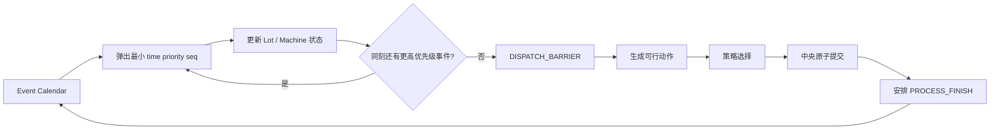

# 可信轻量 DES 架构

适用版本：Simulation Contract `0.1.0`  
当前能力：Basic DES，已验证 MC01、MC02  
锁定能力：Setup、Batch、CQT、Dedication、Failure/PM、正式 SMT2020 loader

## 1. 模块边界

| 模块 | 文件 | 职责 |
| --- | --- | --- |
| 场景领域模型 | `domain/models.py` | `MachineSpec`、`LotSpec`、`OperationSpec`、`Scenario` 及加载前校验 |
| 事件定义 | `simulation/events.py` | `Event(time, priority, seq, ...)`、契约优先级、审计 trace |
| 事件内核 | `simulation/engine.py` | 日历推进、状态机、统一派工屏障、路线推进、终止和指标 |
| 随机流 | `simulation/random_streams.py` | 由 seed/stream/entity/occurrence 派生随机量 |
| provenance | `simulation/provenance.py` | Contract、数据、commit、seed、配置、策略和终止条件 |
| 派工接口 | `policies/base.py` | `DispatchPolicy.select(state, feasible_actions)` |
| FIFO | `policies/fifo.py` | 当前工序入队时刻优先，实体 ID 稳定打破平局 |
| 数据身份 | `data/identity.py` | 对数据文件路径及原始 SHA-256 生成 manifest hash |

## 2. 事件推进



`Event` 的可比较字段只有：

```text
(time, priority, seq)
```

`entity_id`、`payload` 和枚举值不参与排序。`seq` 由单调计数器生成，因此不依赖 dict/set 的隐式顺序。

Basic DES 当前启用：

```text
PROCESS_FINISH priority=10
LOT_RELEASE priority=40
DISPATCH_BARRIER priority=60
```

同一时刻先处理全部完成，再处理投放，最后在统一状态快照上派工。

## 3. 状态机

```text
Lot:
UNRELEASED → QUEUED → PROCESSING → QUEUED ... → COMPLETED

Machine:
IDLE → PROCESSING → IDLE
```

lot 完成一道工序时：

1. 记录 `PROCESS_FINISH` 和设备占用区间；
2. 设备回到 `IDLE`；
3. 若有下一工序，记录 `ROUTE_ADVANCE` 并进入其队列；
4. 否则记录 `LOT_COMPLETE`；
5. 安排同刻 `DISPATCH_BARRIER`。

策略只接收已经通过资格过滤的 `DispatchAction`。内核按 machine ID 稳定遍历，并在每次选择后立即原子预留 lot 和 machine，防止一个 lot 被多台设备重复占用。

## 4. 终止

- `until_all_complete`：所有场景 lot 完成；事件日历提前耗尽时抛出 `SimulationError`，不返回伪完成结果。
- `fixed_horizon`：处理所有 `time <= horizon` 的事件，在 horizon 截断并保留 terminal WIP。

MC01、MC02 使用 `until_all_complete`；另有独立测试验证 fixed horizon 截断。

## 5. Trace 与结果

完整 trace 记录：

```text
run_id, event_seq, sim_time, priority, event_type,
lot_id, visit_index, route_id, step_id,
machine_id, tool_group_id, batch_id,
state_before, state_after, cause_event_seq
```

`key_trace()` 保留人工核算所需的 `LOT_RELEASE / DISPATCH / PROCESS_START / PROCESS_FINISH / ROUTE_ADVANCE / LOT_COMPLETE`。完整 trace 仍包含 `DISPATCH_BARRIER`。

当前 KPI：

- completed/released lots；
- completion ratio；
- completed lot mean cycle time；
- throughput lots/min；
- terminal WIP；
- simulation end time。

每个结果始终包含 `simulation_contract_version`、`dataset_version`、`git_commit`、`seed`、配置摘要、策略和终止条件。

## 6. 当前验证边界

| 机制 | 状态 | 自动化证据 |
| --- | --- | --- |
| Event heap 的 time/priority/seq | VERIFIED | 同刻优先级与 seq 测试 |
| 动态 release | VERIFIED | MC02 |
| FIFO queue | VERIFIED | MC02 |
| route progression | VERIFIED | MC01 |
| machine 占用区间 | VERIFIED | MC01、MC02 |
| all-complete termination | VERIFIED | MC01、MC02 |
| fixed horizon | VERIFIED | 独立 terminal WIP 测试 |
| 实体索引随机流 | VERIFIED | 调用顺序独立性测试 |
| provenance | VERIFIED | 必填字段测试 |
| Setup 及以后机制 | LOCKED | 不得进入运行路径 |

MC03 之后的机制必须继续沿用现有 Event、TraceRecord、DispatchPolicy 和 SimulationResult 边界，不能为兼容外部仿真器绕开契约。
