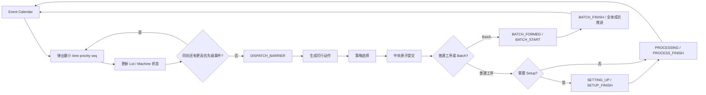

# 可信轻量 DES 架构

适用版本：Simulation Contract `0.1.3`
当前能力：Basic DES + Setup + Batch + CQT + Dedication + preemptive-resume Failure/PM，已验证 MC01～MC08

锁定能力：正式 SMT2020 loader、优化器

## 1. 模块边界

| 模块 | 文件 | 职责 |
| --- | --- | --- |
| 场景领域模型 | `domain/models.py` | `MachineSpec`、`LotSpec`、`OperationSpec`、`Scenario` 及加载前校验 |
| 事件定义 | `simulation/events.py` | `Event(time, priority, seq, ...)`、契约优先级、审计 trace |
| 事件内核 | `simulation/engine.py` | 日历推进、状态机、统一派工屏障、路线推进、终止和指标 |
| Setup resolver | `simulation/setup.py` | 按冻结优先级唯一解析换型时长；缺失时明确失败 |
| Batch formation | `simulation/batch.py` | compatibility 分组、wafer 容量、确定性成员选择与 timeout 决策 |
| CQT runtime | `simulation/cqt.py` | 独立约束索引、活动时钟、闭合记录、slack/risk 与期末暴露 |
| Dedication runtime | `simulation/dedication.py` | 物理机绑定、硬可行性过滤、生命周期与初始 WIP 缺口审计 |
| PM runtime | `simulation/pm.py` | 日历 PM occurrence、wafer counter、pending/active 状态与独立随机流 |
| 随机流 | `simulation/random_streams.py` | 由 seed/stream/entity/occurrence 派生随机量 |
| provenance | `simulation/provenance.py` | Contract、数据、commit、seed、配置、策略和终止条件 |
| 派工接口 | `policies/base.py` | `DispatchPolicy.select(state, feasible_actions)` |
| FIFO | `policies/fifo.py` | 当前工序入队时刻优先，实体 ID 稳定打破平局 |
| 数据身份 | `data/identity.py` | 对数据文件路径及原始 SHA-256 生成 manifest hash |

## 2. 事件推进



`Event` 的可比较字段只有：

```text
(time, priority, seq)
```

`entity_id`、`payload` 和枚举值不参与排序。`seq` 由单调计数器生成，因此不依赖 dict/set 的隐式顺序。

Basic DES 当前启用：

```text
PROCESS_FINISH / SETUP_FINISH / BATCH_FINISH priority=10
LOT_RELEASE priority=40
BATCH_TIMEOUT priority=50
DISPATCH_BARRIER priority=60
```

同一时刻先处理全部完成，再处理投放，最后在统一状态快照上派工。

## 3. 状态机

```text
Lot:
UNRELEASED → QUEUED → RESERVED → PROCESSING → QUEUED ... → COMPLETED

Machine:
IDLE → PROCESSING → IDLE
IDLE → SETTING_UP → PROCESSING → IDLE
IDLE → PROCESSING(active_batch_id) → IDLE

Availability:
UP ↔ DOWN(downtime_cause=FAILURE/CALENDAR_PM/WAFER_PM)
```

派工提交后，lot 与 machine 先被原子保留。内核集中调用 `SetupDurationResolver`：

```text
无 setup 要求或 current == required → 0
operation.setup_override_minutes
→ exact (current_setup, required_setup)
→ initial fallback ("", required_setup)
→ SetupResolutionError
```

正时长 setup 产生独立 `SETUP_START` trace 和 `SETUP_FINISH` 日历事件；完成后先更新 `machine.current_setup`，再对已保留 lot 发出 `PROCESS_START`。FIFO 只选择可行动作，不包含 setup 判断。

Batch 路径分为三层：

```text
Eligible: 当前 operation 可由 machine 加工
Compatible: crit_sameroutestep，即 route_id + step_id 相同
Selected: 按 queue_entered_at、lot_id 稳定排序，累计 wafer 不超过 B_max
```

`BatchFormation` 先检查 `B_min`，再检查 `B_target` 或真实最老等待是否达到 `T_max`。达到合法最小容量但尚未达到目标时，内核安排 `BATCH_TIMEOUT`；该事件仅请求重新评价，不直接启动。token 已失效的 stale timeout 记录为无副作用事件。Batch ID 使用仿真内单调序号 `BATCH-000001`。

一个 Batch 只产生一次物理 `BATCH_START/BATCH_FINISH` 和一个 `BatchInterval`。成员共享起止时刻，每个 lot 的 `PROCESS_START/PROCESS_FINISH` 通过同一 `batch_id` 关联。machine 使用普通 `PROCESSING` 与 `active_batch_id` 表示批占用，不增加重复的 BATCHING 状态。

CQT 在领域层使用 `CQTSpec(constraint_id, route_id, source_step_id, target_step_id, max_duration_minutes)` 独立建模。运行时以 `(lot_id, constraint_id, visit_index)` 索引 `ActiveCQTClock`：source 的真实 `PROCESS_FINISH` 后记录 `CQT_OPEN`，target 的真实 `PROCESS_START` 后记录 `CQT_CLOSE`；超限时追加 `CQT_VIOLATION`，但不改变 feasible actions。Setup、排队、中间加工以及后续搬运只要处于这两个物理时点之间，都会自然计入 duration。FIFO 不读取 CQT。

CQT 不安排 deadline 日历事件，也不强制派工或抢占。活动时钟按需返回 `slack=limit-(t-opened_at)` 与 `risk=(t-opened_at)/limit`。fixed horizon 时，仍开放的时钟进入 `TerminalCQTSnapshot`，并将 `max(0, horizon-deadline)` 单列为 terminal exposure。

Dedication 使用 `DedicationSpec(dedication_id, route_id, source_step_id, target_step_id)`。`_eligible_actions()` 先检查普通 qualification，再调用只读 `DedicationRuntime.allows_machine()`；因此 BatchFormation 看到的也是已通过绑定约束的 lot。source step 的动作真正提交、lot 进入 `RESERVED` 后，内核才建立 `(lot_id, dedication_id, visit_index) → machine_id`。target machine 忙时保持排队，不向同组空闲机 fallback；target `PROCESS_FINISH` 后记录 `DEDICATION_RELEASE`。候选枚举、策略排序和被拒动作不会改变 runtime。

初始 WIP 若已经越过 source、尚未完成 target，则不猜测历史 machine。`LOT_RELEASE` 时记录 `DEDICATION_HISTORY_UNKNOWN` 与 `initial_wip_missing_dedication`，该 target 仅按普通 qualification 派工。fixed horizon 不清除活动绑定，结果通过 `active_dedication_bindings` 保留 terminal state。

Failure 与 PM 共用 `_InterruptedActivity`、`activity_token`、暂停区间和 resume 路径。Calendar PM 可抢占 Setup、普通加工和整个 Batch；Wafer PM 只在真实完成后按 wafer 数置为 pending，并在下一派工前执行。每台 machine 同时只有一个 downtime owner，因此 PM finish 或 repair 只能释放自己拥有的停机。旧 completion 事件因 token 失效而无副作用。PM 与 Failure 的 occurrence、停机区间、计数和 provenance 分开记录。

lot 完成一道工序时：

1. 记录 `PROCESS_FINISH` 和设备占用区间；
2. 设备回到 `IDLE`；
3. 若有下一工序，记录 `ROUTE_ADVANCE` 并进入其队列；
4. 否则记录 `LOT_COMPLETE`；
5. 安排同刻 `DISPATCH_BARRIER`。

策略只接收已经通过资格过滤的 `DispatchAction`。内核按 machine ID 稳定遍历，并在每次选择后立即原子预留 lot 和 machine，防止一个 lot 被多台设备重复占用。

## 4. 终止

- `until_all_complete`：所有场景 lot 完成；事件日历提前耗尽时抛出 `SimulationError`，不返回伪完成结果。
- `fixed_horizon`：处理所有 `time <= horizon` 的事件，在 horizon 截断并保留 terminal WIP。

MC01～MC08 使用 `until_all_complete` 或算例显式 fixed horizon；独立测试验证 horizon 截断 setup、batch、故障/PM、开放 CQT，以及未完成 target 的活动 Dedication 绑定。

## 5. Trace 与结果

完整 trace 记录：

```text
run_id, event_seq, sim_time, priority, event_type,
lot_id, visit_index, route_id, step_id,
machine_id, tool_group_id, batch_id,
batch_member_lot_ids, batch_member_wafers,
batch_total_wafers, batch_start_reason,
cqt_constraint_id, cqt_source_step_id, cqt_target_step_id,
cqt_limit, cqt_opened_at, cqt_deadline, cqt_closed_at,
cqt_actual_duration, cqt_slack, cqt_violation, cqt_excess_duration,
dedication_id, dedication_source_step_id, dedication_target_step_id,
dedication_bound_machine_id, dedication_established_at,
dedication_released_at, dedication_audit_reason,
state_before, state_after, cause_event_seq
```

`key_trace()` 保留人工核算所需的 `LOT_RELEASE / DISPATCH / SETUP_START / SETUP_FINISH / BATCH_TIMEOUT / BATCH_FORMED / BATCH_START / BATCH_FINISH / PROCESS_START / PROCESS_FINISH / CQT_OPEN / CQT_CLOSE / CQT_VIOLATION / DEDICATION_BIND / DEDICATION_RELEASE / DEDICATION_HISTORY_UNKNOWN / ROUTE_ADVANCE / LOT_COMPLETE`。完整 trace 仍包含 `DISPATCH_BARRIER` 和 `BATCH_TIMEOUT_STALE`。

当前 KPI：

- completed/released lots；
- completion ratio；
- completed lot mean cycle time；
- throughput lots/min；
- terminal WIP；
- simulation end time。

CQT 结果另含 closed count、已闭合 violation count、total/max excess、open count、overdue open count 与 terminal exposure。已闭合违规和期末仍开放且超期的窗口分开统计，CQT 不改变生产 KPI 定义。

Dedication 结果包含已释放 binding records、期末 active binding snapshots、初始 WIP 历史缺口 audits，以及 binding/released/active/initial-unknown 计数；不改变 throughput、cycle time、CQT 或 terminal WIP 定义。

`MachineStatistics` 分开记录 `processing_time`、`setup_time`、`failure_downtime`、`pm_downtime` 和 `idle_time`。固定 horizon 截断正在进行的 setup 或 PM 时，只累计实际活动/停机片段；不会把 downtime 吞入 processing/setup/idle-up。Lot cycle time 仍为 `completion-release`。

`BatchInterval` 记录 batch identity、machine、成员及 wafer 数、route/step、启动原因和物理起止。fixed horizon 截断活动 batch 时使用 `ActiveBatchSnapshot` 保留成员、开始和计划完成时刻，成员继续计入 terminal WIP。

每个结果始终包含 `simulation_contract_version`、`dataset_version`、`git_commit`、`seed`、配置摘要、策略和终止条件。

## 6. 当前验证边界

| 机制 | 状态 | 自动化证据 |
| --- | --- | --- |
| Event heap 的 time/priority/seq | VERIFIED | 同刻优先级与 seq 测试 |
| 动态 release | VERIFIED | MC02 |
| FIFO queue | VERIFIED | MC02 |
| route progression | VERIFIED | MC01 |
| machine 占用区间 | VERIFIED | MC01～MC08 |
| all-complete termination | VERIFIED | MC01～MC08 |
| fixed horizon | VERIFIED | 普通加工、Setup、Batch terminal WIP 测试 |
| 实体索引随机流 | VERIFIED | 调用顺序独立性测试 |
| provenance | VERIFIED | 必填字段测试 |
| Setup resolver 优先级与缺失错误 | VERIFIED | resolver 单元测试 |
| Setup 状态、事件、占用与 setup identity | VERIFIED | MC03 |
| MC03 确定性与 Setup provenance | VERIFIED | 重复运行与配置断言 |
| Batch wafer 容量与 compatibility | VERIFIED | MC04 与边界测试 |
| Batch timeout、stale token、同刻排序 | VERIFIED | MC04 timeout 测试 |
| Batch fixed horizon 与单次机器占用 | VERIFIED | active batch 快照与统计测试 |
| CQT 跨步开闭、精确期限与软约束 | VERIFIED | MC05 两个金标准变体 |
| 多 CQT 时钟、slack/risk 与非法重复开闭 | VERIFIED | CQT runtime 单元测试 |
| CQT fixed horizon 开放暴露 | VERIFIED | safe/overdue terminal 测试 |
| Setup/Batch 的实际 PROCESS 事件 CQT 钩子 | VERIFIED | 组合边界测试 |
| Dedication 原子绑定、具体机硬过滤与生命周期 | VERIFIED | MC06 金标准与 runtime 单元测试 |
| Dedication 初始 WIP、qualification 冲突与 terminal binding | VERIFIED | 审计、异常与 fixed-horizon 测试 |
| Dedication 与 Setup/CQT/Batch 组合边界 | VERIFIED | 组合边界测试 |
| Failure | VERIFIED | MC07 显式事件、抢占继续、stale completion 与终态快照 |
| PM | VERIFIED | MC08 Calendar/Wafer PM、抢占恢复、计数、重叠、同刻优先级与 fixed horizon |

MC01～MC08 已全部通过。`fab_scheduler.evaluation.audit` 从 trace 独立重算基础 lot 指标，并检查 lot/machine 时间守恒、Batch 容量、CQT 与 Dedication 记录。M1 Closure Audit 已完成，但原始门槛 M1-E06、M1-E07、M1-E10 仍有 GAP，因此 M1 为 `not_passed_gaps`，优化器继续禁用。完整结论见 `m1-closure-audit.md`。
